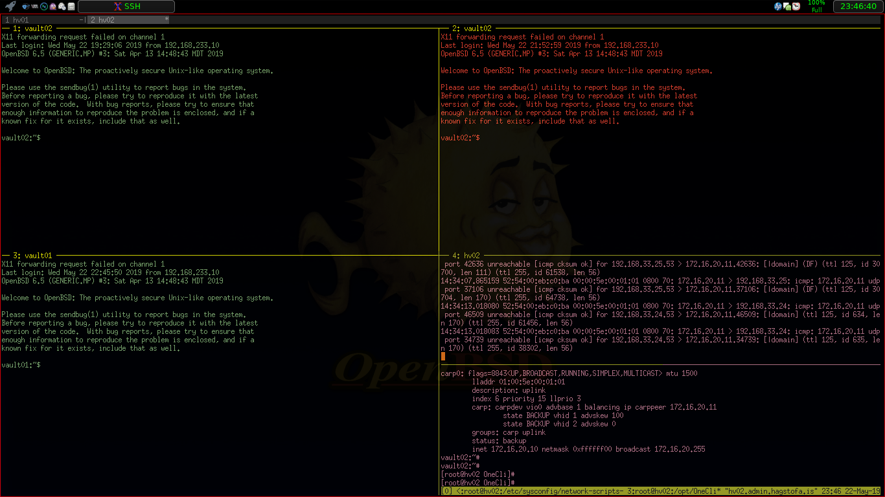

MOVED TO MY OWN SERVER https://gitea.werler.is/Public/tmux_ssh

ssh.sh is a small wrapper script around ssh to open a ssh connection in tmux.

The main purpose of this script is to configure the tmux windows titles with
the hostnames provided by the ssh command line itself. I have often to connect
to cloud hosts with crude hostnames I can't remember and therefore I prefer to
use cnames or hostnames set via .ssh/config - and exactly these names should
be used for window names in tmux and not set via escape sequences (pane
titles) from within the target hosts to their crude names.

Additionally a map file can be configured which stores styles for tmux panes
matched by patterns - like in ssh_config the first count matches. This makes
it easier to see which pane has a ssh connection to which host when e.g. the
hostnames are the same but from different subdomains.

Simply place ssh.sh, ssh.conf and ssh.map into the same directory. It should
not interfere with existing configs because it starts an own server at an own
socket with an own session. For testing simply run "sh ssh.sh -c targethost".
Without arguments it starts a session without ssh and attaches a xterm to it.

It can be configured via a shell alias like this:
```
   alias ssh="sh ~/.tmux/ssh.sh -c"
```
I wrote and tested this with OpenBSD's ksh. I guess bash should work too but
not tested yet.

As a lucky OpenBSD user I also use cwm as my preferred window manager.  This
script can also be used with cwm's wonderful "ssh to" dialog by placing the
following into your .cwmrc:
```
   command term 'sh -c ". ~/.tmux/ssh.sh -c $1"'
   bind CM-Return xterm
   
   # ...to launch the server only with one window with default shell
   bind CM-s 'sh -c ". ~/.tmux/ssh.sh -c"'
   
   # ...and if autogroup is preferred
   autogroup 1 "SSH,XTerm"

   # ...or if you want prefer to use rofi place this into the config
   ssh-command: "sh ~/.tmux/ssh.sh -c {host}";
```
If you have xdotool installed it also focusses the xterm which is attached to
the session or spawns a new term and reattaches to an existing session.

Special thanks go to the OpenBSD developers for providing such a high quality
and stable operating system and to Nicholas Marriot for tmux - a tool I can't
work without it and his patience to answer my questions.

Enjoy.

With my sample config it looks then like this:


